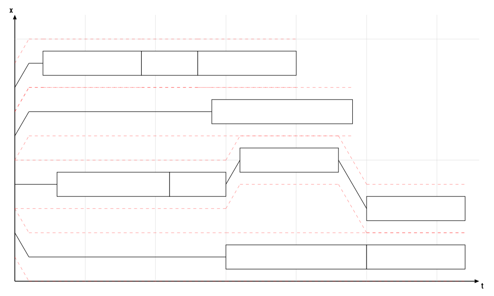

# GCSPET.jl

This Julia package provides functionality for the Gantry Crane Scheduling Problem with External Trucks. Available functions are:

- IO: reading in and writing out instances and solutions to the GCSPET
- generation: create new instances using the original distributions, or using your own model.
- validation: validate the correctness of a solution-file against an instance-file.
- visualization: create and export visualizations to SVG, PNG, ... (functionality provided through [Luxor](https://github.com/JuliaGraphics/Luxor.jl))


## IO
### Reading and writing files
Use following functions to read and write instances and solutions.

```julia
using GCSPET

julia> fpath = getinstance("GCSPET_Guo", "10_2_0.4_1.dat")
"datadepsdir/GCSPET_Guo/SGCSPET_Instances/10_2_0.4_1.dat"

julia> inst = GCSPET.read(fpath, Instance)
Instance("10_2_0.4_1.dat", Job)
```

### Generating instances
A simple script is provided to generate instances from a parameter-grid, using the original distributions as presented in:
[Peng Guo, Wenming Cheng, Yi Wang & Nils Boysen (2018) Gantry crane scheduling in intermodal rail-road container terminals, International Journal of Production Research, 56:16, 5419-5436, DOI: 10.1080/00207543.2018.1444812 ](https://www.tandfonline.com/doi/abs/10.1080/00207543.2018.1444812)

```julia
njobs = 100
ncranes = 4
load = 0.5

inst = generate_instance(njobs, ncranes, load)
GCSPET.write(inst, "instance.dat")
```

### File Formats
#### Instance files
GCSPET instance files carry the extension `.dat` and have the following format (comments not present in file):

```
10                              # number of jobs (njobs)
4                               # number of cranes (ncranes)
2,4,6,8                         # crane starting positions along non-crossing axis
1,1,3,4,4,5,7,9,9,9             # job positions along non-crossing axis
2,1,1,2,2,1,2,2,1,1             # job types (1 = train, 2 = truck)
10,7,7,8,4,7,10,7,4,7           # processing times
1,1,1,1,2,1,1,1,1,2             # move types (1 = unloading 2 = loading)
15,0,0,3,7,0,14,2,0,0           # arrival times
```

#### Solution files
GCSPET solution files carry the extension `.sched` and have the following format (comments not present in file): 
- repetition of all of the instance data (note: a line including the ids is added, to allow out-of-order data)
- crane trajectories for each crane, each consisting of sequences for:
    * id
    * position along the x-axis (non-crossing axis)
    * timestamp
    * job-ids (-1  = no job)

```
10
4
2,4,6,8
9,3,0,7,8,1,6,5,2,4
1,1,3,4,4,5,7,9,9,9
2,1,1,2,2,1,2,2,1,1
10,7,7,8,4,7,10,7,4,7
1,1,1,1,2,1,1,1,1,2
15,0,0,3,7,0,14,2,0,0
0
x,2,1,1,1,1,1
t,0,1,15,25,25,32
j,-1,-1,9,9,3,3
1
x,4,4,4,4,4,4,5,5,3,3
t,0,0,3,11,11,15,16,23,25,32
j,-1,-1,7,7,8,8,1,1,0,0
2
x,6,7,7,7
t,0,1,14,24
j,-1,-1,6,6
3
x,8,9,9,9,9,9,9,9
t,0,1,2,9,9,13,13,20
j,-1,-1,5,5,2,2,4,4
```

## Visualization

```julia
julia> using GCSPET

julia> sol = GCSPET.read("10_4_0.5_3.sched", Solution)
julia> draw(sol, 1000, 800, "solution.png")
```




```julia
using GCSPET, Colors

sol = GCSPET.read("80_6_0.5_2.sched")

cfg = GCSPET.VizData(6)

cfg.jobcolors = [RGBA(0.0,0.0,1.0,1.0) RGBA(0.4,0.4,1.0,1.0);
                 RGBA(0.0,1.0,0.0,1.0) RGBA(0.6,1.0,0.6,1.0)
                ]

GCSPET.draw(sol, 1000, 600, "solution2.svg", cfg)
```


## Validation
